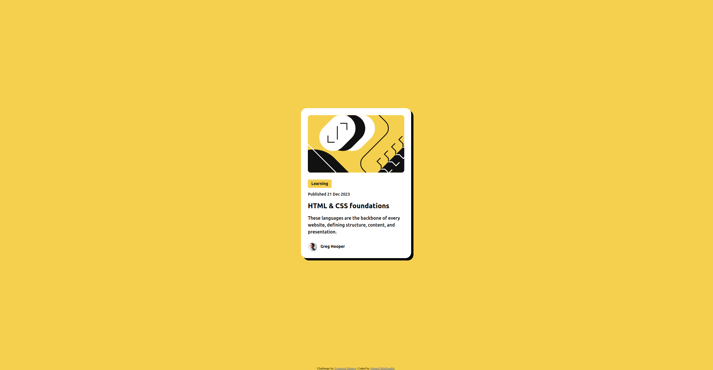

# Frontend Mentor - Blog preview card solution

This is a solution to the [Blog preview card challenge on Frontend Mentor](https://www.frontendmentor.io/challenges/blog-preview-card-ckPaj01IcS).

## Table of contents

- [Overview](#overview)
  - [The challenge](#the-challenge)
  - [Screenshot](#screenshot)
  - [Links](#links)

## Overview

### The challenge

Users should be able to:

- See hover and focus states for all interactive elements on the page

### Screenshot

### Links

- Solution URL: [SOLUTION](https://github.com/ahmedmahfoudhi/frontend-mentor-challenges/blog-preview-card)
- Live Site URL: [LIVE_SITE](https://ahmedmahfoudhi.github.io/frontend-mentor-challenges/blog-preview-card/)