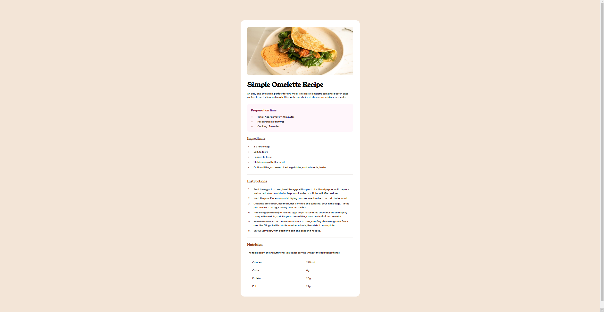

# Frontend Mentor - Recipe page solution

This is a solution to the [Recipe page challenge on Frontend Mentor](https://www.frontendmentor.io/challenges/recipe-page-KiTsR8QQKm).

## Table of contents

- [Overview](#overview)
  - [The challenge](#the-challenge)
  - [Screenshot](#screenshot)
  - [Links](#links)

**Note: Delete this note and update the table of contents based on what sections you keep.**

## Overview

### Screenshot

### Links

- Solution URL: [SOLUTION](https://github.com/ahmedmahfoudhi/frontend-mentor-challenges/tree/main/recipe-page)
- Live Site URL: [LIVE_SITE](https://ahmedmahfoudhi.github.io/frontend-mentor-challenges/recipe-page/index.html)
